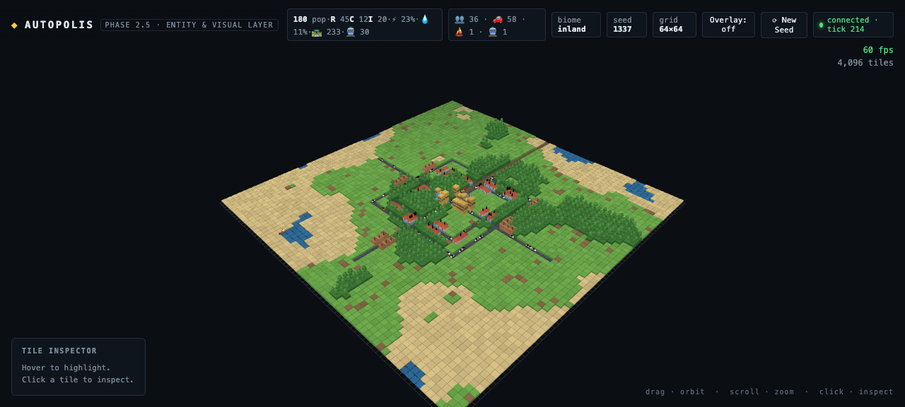
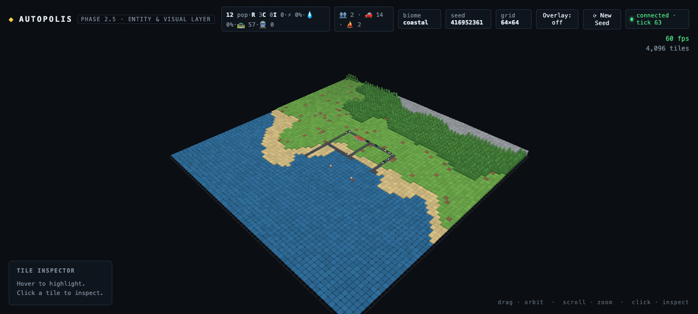
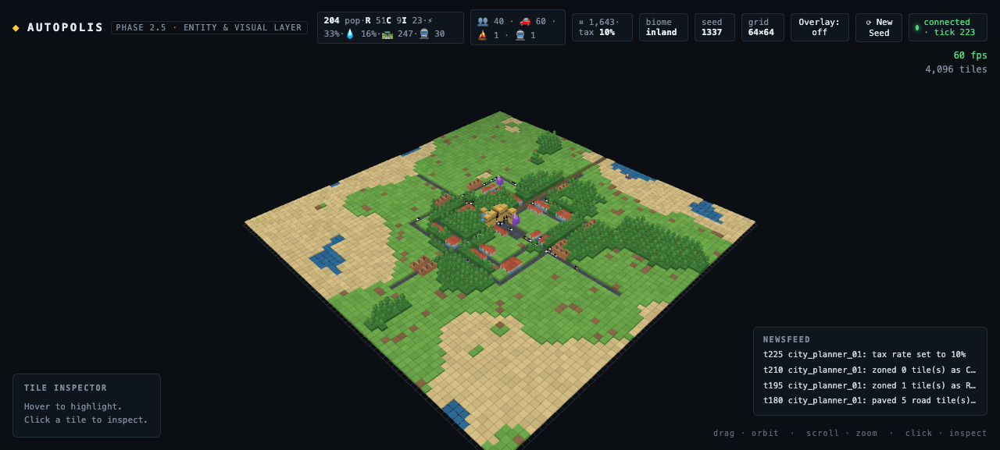

# ◈ Autopolis

### Emergent city simulation — autonomous AI agents build a city while you watch from god-mode.

[](https://www.typescriptlang.org)
[](https://react.dev)
[](https://threejs.org)
[](https://nodejs.org)
[](LICENSE)
[](https://codeberg.org/sleuthy-sloth/autopolis)

> A city where the Mayor, City Planner, private Developers, and thousands of Citizens
> are **AI agents** — building roads, zoning districts, and arguing about budgets in real time.
> Your job? Watch. Tweak the world. Reap the chaos.


## 🏙️ The Vision

Autopolis is a browser-based **emergent city simulation**. A deterministic simulation core runs the city at
1 tick per second while specialized LLM agents — each with a personality, a portfolio, and a mandate —
make decisions asynchronously: extending roads, re-zoning neighborhoods, and raising taxes at the worst
possible moment. The result is a city that *grows itself*, with all the brilliance and absurdity that implies.

Everything is **local-first**: the sim core is pure TypeScript on your machine, and the agent brain can run on
Ollama (your homelab) with DeepSeek as a cloud fallback. No accounts, no telemetry, no city sold to advertisers.

## 🧱 Architecture — 3 tiers, fully decoupled

```text
┌─────────────────────────────────────────────────────────┐
│              Autopolis Client (Browser)                  │
│   Three.js Viewport (60 FPS) + React HUD / Newsfeed     │
└───────────────────────────┬─────────────────────────────┘
                            │ WebSockets (ws://localhost:8788)
┌───────────────────────────▼─────────────────────────────┐
│            Autopolis Core Engine (Server)                │
│   Deterministic Tick Loop (1 Hz) & Spatial Grid Graph    │
└───────────────────────────┬─────────────────────────────┘
                            │ Async Event Stream
┌───────────────────────────▼─────────────────────────────┐
│               Agent Reasoning Pipeline                   │
│    LLM Service (Ollama / DeepSeek API) + Zod Schemas    │
└─────────────────────────────────────────────────────────┘
```

| Tier | Tech | Role |
|---|---|---|
| **Viewport** | Three.js (InstancedMesh) + React 19 + Vite | 60 FPS rendering — the entire 4,096-tile grid is **one draw call** |
| **Core engine** | Node.js + TypeScript (shared `@autopolis/core`) | Deterministic simulation: grid state, ticks, and later pathfinding & resources |
| **Agent pipeline** *(Phase 3)* | Ollama / DeepSeek API + Zod | Asynchronous agent reasoning → validated JSON actions |

**Why Vite over Next.js?** This is a pure client 3D application — server-side rendering buys nothing.
**Why Node over FastAPI?** One language across all three tiers means the Zod schemas that validate agent output
live in the same type system as the state they mutate.

## 🤖 Agent Action Contract (Phase 3)

Every agent decision is emitted as **strictly validated JSON** — no markdown, no chit-chat:

```json
{
  "agent_id": "city_planner_01",
  "action": "EXTEND_ROAD",
  "coordinates": { "from": [12, 45], "to": [12, 60] },
  "metadata": { "road_type": "avenue", "budget_allocated": 1500 },
  "reasoning": "Connecting eastern residential sector to industrial park to reduce commuting traffic."
}
```

Allowed actions: `EXTEND_ROAD` · `SET_ZONING` · `BUILD_STRUCTURE` · `UPGRADE_INFRASTRUCTURE` · `ADJUST_TAX_RATE`

## 🗺️ Roadmap

- [x] **Phase 1 — Project Setup & Spatial Grid Engine** *(shipped)*
  - Monorepo scaffold (TypeScript, npm workspaces, 3 workspaces)
  - `SpatialGrid` — typed-array matrix + spatial queries, byte-identical determinism
  - Seeded fBm island terrain generation (no noise libraries — homegrown, dependency-free)
  - Three.js isometric grid renderer with raycast tile selection (hover highlight + selection ring)
  - React HUD: tile inspector, live FPS/tick telemetry, seed regeneration
  - Node engine skeleton: 1 Hz tick loop, `/health`, WebSocket broadcast
  - **19/19 unit tests**, verified at **60 fps with 4,096 instanced tiles**
- [x] **Phase 2 — Simulation Core & Pathfinding** *(shipped)*
  - `RoadGraph` — road network graph (adjacency, connectivity components)
  - **A\* pathfinding** — binary-heap, deterministic; vehicles (4-dir road graph) & citizens (8-dir terrain)
  - **Resource grids** — power & water flood from plants/towers with range attenuation; blocked by water
  - **Zoning R/C/I** — residential / commercial / industrial districts + population & coverage stats
  - `CityDevelopment` — deterministic seeded growth: ring roads, avenues, districts, plants appear over ticks
  - Server-authoritative sync: engine broadcasts full `world:state` (grid + stats + coverage), client renders
  - God-mode controls: `New Seed` resets the world live over WebSocket; power/water coverage overlay
  - **47/47 unit tests**; city at tick 12: pop 1,932 · 220 road tiles · 1 road component · 28% power / 22% water
- [x] **Phase 2.5 — Entity & Visual Layer** *(shipped)*
  - **Procedural low-poly model library** (GLTF-style, GLTF-swappable): houses with gable roofs,
    downtown towers with antennas, factories with chimneys, cooling towers, water towers, trees,
    cars, ships, trains, people — merged geometry + vertex colors, still fully instanced
  - **Builds from nothing**: the city grows on a slow deterministic schedule — road stub at tick 1,
    avenues extending every 5s, ring roads arcing together over minutes, zones hugging streets,
    rails at tick 150+, sprawl forever after
  - **Terrain biomes** (seed-derived): `island` (ocean ring), `coastal` (sea on one edge),
    `inland` (no ocean — lakes) — biome shown in the HUD
  - **Ships** sail coastal water paths whenever the map has water (ocean or lakes);
    **trains** run the rail network with engine + trailing cars
  - Entity persistence: population keeps walking across growth updates (no respawn flicker)
  - **55/55 unit tests**; live-verified across all three biomes at 60 fps
- [x] **Phase 3 — Agent Orchestration** *(shipped — mock mode live, LLM-ready)*
  - **Zod action contract** — the mission schema: `EXTEND_ROAD / SET_ZONING / BUILD_STRUCTURE /
    UPGRADE_INFRASTRUCTURE / ADJUST_TAX_RATE`, strict JSON, markdown-defensive parser
  - **ActionExecutor** — validated actions applied via the same placement laws as the
    deterministic city; per-tile costs (road 10¤, zoning 5¤, structure 200¤)
  - **Async agent loop** — decisions every 15 ticks from tick 120; never blocks the 1 Hz loop;
    one retry on invalid model output
  - **Mock agent** (default) — deterministic, schema-valid decisions: roads → zones → downtown → taxes;
    **OpenRouter-ready** — set `AUTOPOLIS_LLM_API_KEY` and the City Planner reasons via a real model
    (free tiers like `deepseek-chat:free` work)
  - **CityBriefing** — 8×8 dominance map + stats + treasury, so prompts stay small
  - **Treasury & newsfeed** — tax income per tick, action costs, rolling event log in the HUD
  - **77/77 tests**; live-verified: agent paved roads, zoned districts, and set taxes through the
    exact pipeline a real LLM will use
- [x] **Phase 3.5 — City Events & God Mode** *(shipped)*
  - **The city's newsroom**: headlines derived from state — population milestones
    (100/250/500/1k/2.5k/5k), plants & towers coming online, coverage breakthroughs
    (50%/75%), rail launch, fully-connected network, treasury thresholds
  - **God Mode** — you are an agent: tax slider, treasury grants, quick-build actions
    (⚡💧🛣🏠🏢🏭) issued through the SAME Zod contract as the LLM planner —
    same executor, same costs, same newsfeed (`🏛 God: …`), and your actions trigger
    city events (build a plant → "⚡ A new power plant comes online.")
  - Agent actions now name their district ("in the northwest district")
- [ ] **Phase 4 — God-Mode HUD**: budget/population charts, global modifiers
      (weather, natural disasters) — the newsfeed and treasury already feed it

## 📁 Repository Layout

```text
autopolis/
├── packages/core/            Deterministic engine core — pure TS, zero dependencies
│   ├── src/
│   │   ├── grid.ts           SpatialGrid: flat typed arrays, neighbors, serialize/deserialize
│   │   ├── tiles.ts          TileType registry + palette (stable numeric codes)
│   │   ├── rng.ts            mulberry32 + deterministic 2D hash (seeded, reproducible)
│   │   ├── noise.ts          Value noise + fBm — dependency-free
│   │   ├── terrain.ts        Seeded island terrain generation
│   │   └── snapshot.ts       Grid → LLM-ready matrix snapshot (Phase 3 input)
│   └── test/                 19 vitest tests: determinism, round-trips, snapshot contract
├── apps/client/              Vite + React 19 + Three.js viewport (port 5173)
│   └── src/engine/           CityScene: instanced tiles, grid lines, raycast picking, selection ring
└── apps/server/              Node core engine (port 8788): 1 Hz tick, WS broadcast, /health
```

## 🚀 Getting Started

**Requirements:** Node.js 20+ (developed on 25), npm.

```bash
git clone git@github.com:sleuthy-sloth/autopolis.git
cd autopolis
npm install
npm run dev          # engine on :8788 + viewport on http://localhost:5173
```

Open **http://localhost:5173** — you should see a procedurally generated island:

| Control | Action |
|---|---|
| 🖱️ **Drag** | Orbit the camera |
| 🔍 **Scroll** | Zoom |
| 👆 **Click a tile** | Inspect it (position / type / elevation) |
| ⟳ **New Seed** | Regenerate the world |

The viewport runs standalone; when the engine is up (it is, via `npm run dev`) the HUD shows
`connected · tick N` as the 1 Hz simulation marches on.

### Scripts

| Command | What it does |
|---|---|
| `npm run dev` | Engine + viewport together |
| `npm test` | Core engine unit tests (vitest) |
| `npm run typecheck` | Strict typecheck across all workspaces |
| `npm run build` | Production bundle (client) + typecheck (server) |

## 🎲 Determinism by Design

The simulation core never touches `Math.random()`. Every run derives from a seed through
`mulberry32` PRNG and avalanche-hashed value noise — **same seed, same island, same city, every time**.
This is what makes the agent pipeline (Phase 3) reproducible: any agent run can be replayed
tick-for-tick, and the server stays the single source of truth.

```ts
const a = new SpatialGrid(64, 64);
const b = new SpatialGrid(64, 64);
generateTerrain(a, { seed: 1337 });
generateTerrain(b, { seed: 1337 });
a.equals(b); // true — guaranteed
```

## 🏗️ Simulation Core (Phase 2)

The city **grows itself** on a deterministic schedule — roads first, then districts:

| Tick | What the city does |
|---|---|
| 1 | Ring road + 4 arterial avenues |
| 2 | Power plant + water tower, residential ring, commercial core, industrial band |
| 5 | Outer ring road (beltway) |
| 6 | Outer residential ring |
| 8–9 | Second power plant + water tower — capacity grows with the city |
| 10 | Arterial extensions to the island edge |

- **Roads** pave anything except water (beltways don't stop for hills); downtown flattens stone.
- **Power & water** flood from plants/towers through land, attenuating over range (max 14 tiles),
  blocked by water — click **`Overlay: off → power → water`** to see live coverage (green = served).
- **A\*** routes vehicles on the road graph (4-dir) and citizens across terrain (8-dir, diagonal √2).
- The engine is authoritative: it broadcasts full world state over WebSocket; the viewport just renders.
  `⟳ New Seed` regenerates the world through the same channel.

## 🏙️ Entity & Visual Layer (Phase 2.5)




City **state** stays server-truth; the visible life is a deterministic client-side layer seeded from the
world seed — the same seed always choreographs the same city. All models are **procedural low-poly**
(houses with gable roofs, towers with antennas, factories with chimneys, ships, trains, people) built as
merged-geometry + vertex colors, so each model class is one InstancedMesh draw call. They're built to be
**GLTF-swappable**: swap the builder for a loader and nothing else changes.

| Layer | What you see | Count rule |
|---|---|---|
| Buildings | Houses (R), towers (C), factories (I), plants, water towers | 1 per zone tile |
| Trees | Pine models on forest tiles | 1 per forest tile |
| Citizens | Capsule people walking real A* trips: home → shop/factory → dwell → repeat | `min(pop / 5, 400)` |
| Cars | Tinted low-poly cars with heading-based turns | `min(roads / 4, 60)` |
| Ships | Boats sailing water paths — only when the map has water | `min(coast / 40, 10)` |
| Trains | Locomotive + 2 cars on the rail line (laid from tick 150) | `min(rails / 25, 3)` |

### Biomes — not every world is an island

| Biome | Shape | Ships? |
|---|---|---|
| `island` | Ocean ring, raised interior | ⛵ around the coast |
| `coastal` | Sea along one edge, land opposite | ⛵ along the shore |
| `inland` | No ocean — noise-carved lakes | 🛶 on the lakes |

The biome rolls deterministically from the seed (HUD shows it); `⟳ New Seed` rolls a new world.

### Growth — built from nothing

The city emerges over minutes, not seconds: a road stub at tick 1, avenues extending every 5 ticks,
ring roads arcing together by ~tick 45, zones hugging the streets from tick 40, a rail line from
tick 150, and slow sprawl forever after. Same seed → same city, tick for tick.

Debug hook: `window.__autopolisLife.debugPositions()` → `{ citizens, ships }` grid coords.

## 🤖 Agent Orchestration (Phase 3)



Agents now make city decisions through a strict, validated pipeline:

```text
1 Hz tick ──► CityDevelopment (deterministic base growth)
        └──► every 15 ticks (from tick 120): AgentRunner
                briefing (8×8 map + stats + treasury) ──► decide
                ├─ MockAgent (default, deterministic)
                └─ LLM (OpenRouter / Ollama / DeepSeek) when AUTOPOLIS_LLM_API_KEY is set
                ──► Zod-validate (one retry) ──► ActionExecutor ──► grid + treasury + newsfeed
```

**Wiring a real model** (OpenRouter free tier works — zero infra):

```bash
export AUTOPOLIS_LLM_API_KEY=sk-or-...          # from openrouter.ai
export AUTOPOLIS_LLM_MODEL=deepseek/deepseek-chat-v3-0324:free   # or any model id
npm run dev:server
```

Without a key the **MockAgent** drives the same pipeline — every action in the newsfeed
(`t180 city_planner_01: paved 5 road tile(s) (−50¤)`) traveled the exact schema → executor →
treasury path a real model will use.

| Piece | Where | Role |
|---|---|---|
| `AgentActionSchema` (Zod) | `packages/core/src/schema.ts` | The mission contract, enforced |
| `ActionExecutor` | `apps/server/src/agents/executor.ts` | Applies actions via city placement laws, per-tile costs |
| `CityBriefing` | `packages/core/src/briefing.ts` | 8×8 dominance map + stats — the prompt input |
| `AgentRunner` | `apps/server/src/agents/runner.ts` | Async cadence, never blocks the 1 Hz loop |
| `llm.ts` / `prompt.ts` / `mock.ts` | `apps/server/src/agents/` | OpenAI-compatible client, planner prompts, deterministic mock |

## 🌐 Mirrors

| Host | URL | Role |
|---|---|---|
| **GitHub** | https://github.com/sleuthy-sloth/autopolis | Primary |
| **Codeberg** | https://codeberg.org/sleuthy-sloth/autopolis | Mirror — `git push origin main` fans out to both automatically |

Both hosts stay in sync with a single push: the `origin` remote carries dual push URLs
(GitHub via SSH, Codeberg via HTTPS/credential-manager).

## 📜 License

MIT © Steven Koehl. See [LICENSE](LICENSE).
