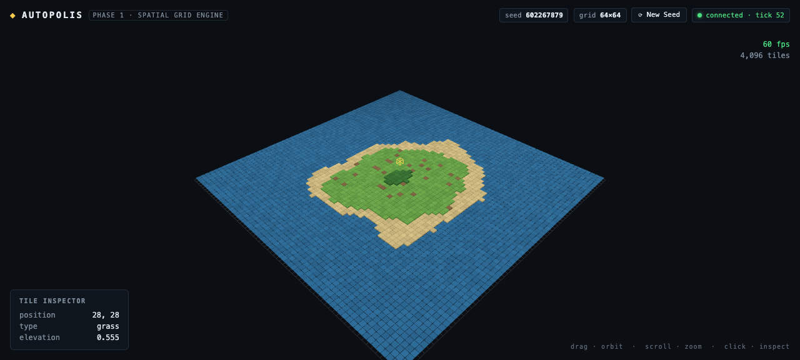

# ◈ Autopolis

### Emergent city simulation — autonomous AI agents build a city while you watch from god-mode.

[](https://www.typescriptlang.org)
[](https://react.dev)
[](https://threejs.org)
[](https://nodejs.org)
[](LICENSE)

> A city where the Mayor, City Planner, private Developers, and thousands of Citizens
> are **AI agents** — building roads, zoning districts, and arguing about budgets in real time.
> Your job? Watch. Tweak the world. Reap the chaos.



## 🏙️ The Vision

Autopolis is a browser-based **emergent city simulation**. A deterministic simulation core runs the city at
1 tick per second while specialized LLM agents — each with a personality, a portfolio, and a mandate —
make decisions asynchronously: extending roads, re-zoning neighborhoods, and raising taxes at the worst
possible moment. The result is a city that *grows itself*, with all the brilliance and absurdity that implies.

Everything is **local-first**: the sim core is pure TypeScript on your machine, and the agent brain can run on
Ollama (your homelab) with DeepSeek as a cloud fallback. No accounts, no telemetry, no city sold to advertisers.

## 🧱 Architecture — 3 tiers, fully decoupled

```text
┌─────────────────────────────────────────────────────────┐
│              Autopolis Client (Browser)                  │
│   Three.js Viewport (60 FPS) + React HUD / Newsfeed     │
└───────────────────────────┬─────────────────────────────┘
                            │ WebSockets (ws://localhost:8788)
┌───────────────────────────▼─────────────────────────────┐
│            Autopolis Core Engine (Server)                │
│   Deterministic Tick Loop (1 Hz) & Spatial Grid Graph    │
└───────────────────────────┬─────────────────────────────┘
                            │ Async Event Stream
┌───────────────────────────▼─────────────────────────────┐
│               Agent Reasoning Pipeline                   │
│    LLM Service (Ollama / DeepSeek API) + Zod Schemas    │
└─────────────────────────────────────────────────────────┘
```

| Tier | Tech | Role |
|---|---|---|
| **Viewport** | Three.js (InstancedMesh) + React 19 + Vite | 60 FPS rendering — the entire 4,096-tile grid is **one draw call** |
| **Core engine** | Node.js + TypeScript (shared `@autopolis/core`) | Deterministic simulation: grid state, ticks, and later pathfinding & resources |
| **Agent pipeline** *(Phase 3)* | Ollama / DeepSeek API + Zod | Asynchronous agent reasoning → validated JSON actions |

**Why Vite over Next.js?** This is a pure client 3D application — server-side rendering buys nothing.
**Why Node over FastAPI?** One language across all three tiers means the Zod schemas that validate agent output
live in the same type system as the state they mutate.

## 🤖 Agent Action Contract (Phase 3)

Every agent decision is emitted as **strictly validated JSON** — no markdown, no chit-chat:

```json
{
  "agent_id": "city_planner_01",
  "action": "EXTEND_ROAD",
  "coordinates": { "from": [12, 45], "to": [12, 60] },
  "metadata": { "road_type": "avenue", "budget_allocated": 1500 },
  "reasoning": "Connecting eastern residential sector to industrial park to reduce commuting traffic."
}
```

Allowed actions: `EXTEND_ROAD` · `SET_ZONING` · `BUILD_STRUCTURE` · `UPGRADE_INFRASTRUCTURE` · `ADJUST_TAX_RATE`

## 🗺️ Roadmap

- [x] **Phase 1 — Project Setup & Spatial Grid Engine** *(shipped)*
  - Monorepo scaffold (TypeScript, npm workspaces, 3 workspaces)
  - `SpatialGrid` — typed-array matrix + spatial queries, byte-identical determinism
  - Seeded fBm island terrain generation (no noise libraries — homegrown, dependency-free)
  - Three.js isometric grid renderer with raycast tile selection (hover highlight + selection ring)
  - React HUD: tile inspector, live FPS/tick telemetry, seed regeneration
  - Node engine skeleton: 1 Hz tick loop, `/health`, WebSocket broadcast
  - **19/19 unit tests**, verified at **60 fps with 4,096 instanced tiles**
- [ ] **Phase 2 — Simulation Core & Pathfinding**: road network graph + A* for vehicles & citizens,
      power/water distribution, zoning (R/C/I) resource grids
- [ ] **Phase 3 — Agent Orchestration**: async agent tick runner, Zod-validated JSON actions,
      prompt templates for City Planner & Developer agents wired to state updates
- [ ] **Phase 4 — God-Mode HUD**: live agent action newsfeed, budget/population charts,
      global modifiers (tax rates, weather, natural disasters)

## 📁 Repository Layout

```text
autopolis/
├── packages/core/            Deterministic engine core — pure TS, zero dependencies
│   ├── src/
│   │   ├── grid.ts           SpatialGrid: flat typed arrays, neighbors, serialize/deserialize
│   │   ├── tiles.ts          TileType registry + palette (stable numeric codes)
│   │   ├── rng.ts            mulberry32 + deterministic 2D hash (seeded, reproducible)
│   │   ├── noise.ts          Value noise + fBm — dependency-free
│   │   ├── terrain.ts        Seeded island terrain generation
│   │   └── snapshot.ts       Grid → LLM-ready matrix snapshot (Phase 3 input)
│   └── test/                 19 vitest tests: determinism, round-trips, snapshot contract
├── apps/client/              Vite + React 19 + Three.js viewport (port 5173)
│   └── src/engine/           CityScene: instanced tiles, grid lines, raycast picking, selection ring
└── apps/server/              Node core engine (port 8788): 1 Hz tick, WS broadcast, /health
```

## 🚀 Getting Started

**Requirements:** Node.js 20+ (developed on 25), npm.

```bash
git clone git@github.com:sleuthy-sloth/autopolis.git
cd autopolis
npm install
npm run dev          # engine on :8788 + viewport on http://localhost:5173
```

Open **http://localhost:5173** — you should see a procedurally generated island:

| Control | Action |
|---|---|
| 🖱️ **Drag** | Orbit the camera |
| 🔍 **Scroll** | Zoom |
| 👆 **Click a tile** | Inspect it (position / type / elevation) |
| ⟳ **New Seed** | Regenerate the world |

The viewport runs standalone; when the engine is up (it is, via `npm run dev`) the HUD shows
`connected · tick N` as the 1 Hz simulation marches on.

### Scripts

| Command | What it does |
|---|---|
| `npm run dev` | Engine + viewport together |
| `npm test` | Core engine unit tests (vitest) |
| `npm run typecheck` | Strict typecheck across all workspaces |
| `npm run build` | Production bundle (client) + typecheck (server) |

## 🎲 Determinism by Design

The simulation core never touches `Math.random()`. Every run derives from a seed through
`mulberry32` PRNG and avalanche-hashed value noise — **same seed, same island, every time**.
This is what makes the future agent pipeline reproducible: any agent run can be replayed
tick-for-tick, and the server stays the single source of truth.

```ts
const a = new SpatialGrid(64, 64);
const b = new SpatialGrid(64, 64);
generateTerrain(a, { seed: 1337 });
generateTerrain(b, { seed: 1337 });
a.equals(b); // true — guaranteed
```

## 🌐 Mirrors

- **GitHub** (primary): https://github.com/sleuthy-sloth/autopolis
- **Codeberg**: mirrored — `git push` fans out to both remotes automatically.

## 📜 License

MIT © Steven Koehl. See [LICENSE](LICENSE).
