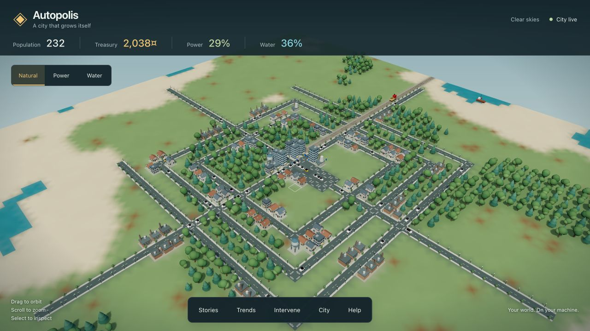
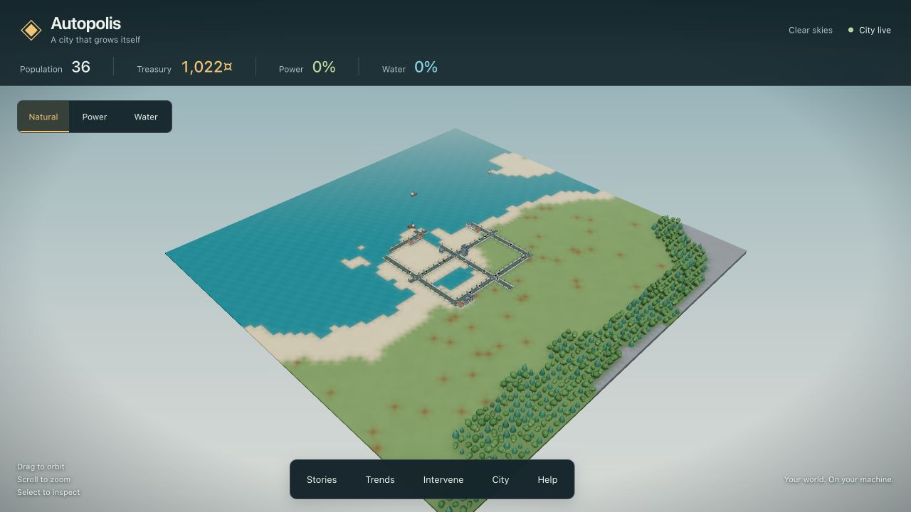
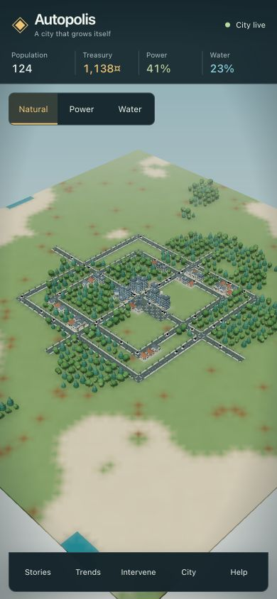

# City visual improvements

The city now reads as a connected miniature landscape: blended natural terrain,
continuous teal water with world-space ripples, varied homes and commercial buildings,
rounded and evergreen canopies, detailed facades, sidewalks, lamps, crossings, and
connected rail bends. Buildings share a street datum instead of sitting on tall colored
pedestals. Vehicles and citizens have appropriate scale and rest on the visible surface.
The camera can move closer to inspect a neighborhood.

Rendering retains instanced structures and water. Surface triangles carry tile IDs for
picking; coverage overlays follow that surface. Moving citizens sample the exact triangle
height, and narrow waterways remain below the waterline. Structure meshes own cloned
geometry so regeneration cannot dispose the cached model library.

## Validation

- `npx vitest run`: 137 passed, 1 existing opt-in contract generator skipped.
- `npm run typecheck`, `npm run build`, `git diff --check`: passed.
- Nine geometry/interaction tests cover model topology, determinism and ownership,
  footprint bounds, rail orientation, terrain continuity, narrow water, surface picking,
  raised-corner coverage and selection, regeneration, and moving entity height sampling.
- Browser: natural view, power coverage, tile inspection, coastal regeneration, saved-world
  restoration, desktop and 390 × 844 viewport rendering; no new console errors or warnings.
- Developed 64 × 64 city reported 60 fps locally. Mobile sizing was checked on a desktop
  browser; physical mobile GPU performance was not measured.
- Existing large Three.js bundle warning remains (909 kB minified / 245 kB gzip).

## Preview

